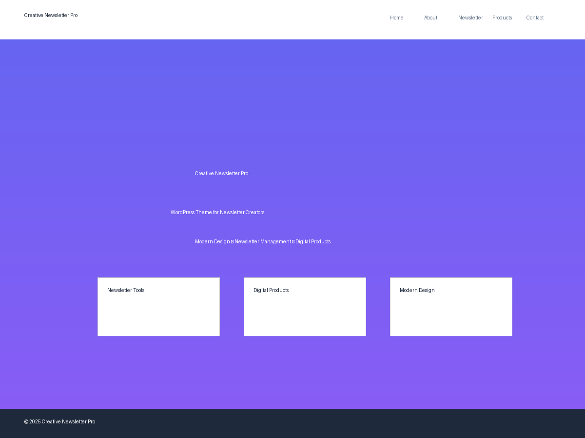

# Creative Newsletter Pro - WordPress Theme

A modern, responsive WordPress theme designed specifically for newsletter creators and digital product sellers. Built with a focus on clean design, performance, and user experience.



## 🌟 Features

### Design & Layout
- **Modern Purple/Blue Gradient Design** - Eye-catching color scheme that stands out
- **Fully Responsive** - Looks perfect on all devices and screen sizes
- **Mobile-First Approach** - Optimized for mobile users first
- **Clean Typography** - Easy-to-read fonts with perfect contrast
- **Smooth Animations** - Engaging scroll animations and hover effects

### Newsletter Functionality
- **Newsletter Signup Forms** - Integrated subscription forms with AJAX
- **Newsletter Archive** - Dedicated page for newsletter management
- **Custom Newsletter Post Type** - Organized content management
- **Subscriber Management** - Built-in subscriber storage and management

### Digital Products
- **Product Showcase** - Beautiful product cards with pricing
- **Custom Product Post Type** - Easy product management
- **Product Metadata** - Price, currency, and external link support
- **E-commerce Ready** - Compatible with WooCommerce and other plugins

### WordPress Integration
- **Custom Post Types** - Newsletters and Products
- **Customizer Integration** - Easy theme customization
- **Widget Areas** - Sidebar and footer widget support
- **Menu Support** - Primary, footer, and social menus
- **SEO Optimized** - Clean, semantic HTML structure

### Performance & Accessibility
- **Fast Loading** - Optimized CSS and JavaScript
- **Accessibility Ready** - WCAG compliant design
- **Browser Compatible** - Works across all modern browsers
- **Translation Ready** - Full i18n support

## 🚀 Quick Start

### Installation

1. **Download the theme** from the repository
2. **Upload to WordPress**:
   - Go to `Appearance > Themes > Add New`
   - Click "Upload Theme"
   - Select the theme ZIP file
   - Click "Install Now"
3. **Activate the theme**
4. **Configure the theme** using the WordPress Customizer

### Theme Setup

1. **Configure Menus**:
   - Go to `Appearance > Menus`
   - Create a Primary Menu and assign it to "Primary Menu" location
   - Optionally create Footer and Social menus

2. **Set Up Widgets**:
   - Go to `Appearance > Widgets`
   - Add widgets to Sidebar and Footer areas

3. **Customize Theme Settings**:
   - Go to `Appearance > Customize`
   - Configure Hero Section, Social Media, and Newsletter settings

4. **Create Sample Pages**:
   - Create pages using the custom page templates:
     - About (select "About Page" template)
     - Newsletter (select "Newsletter Page" template)
     - Products (select "Products Page" template)
     - Contact (select "Contact Page" template)

## 📋 File Structure

```
creative-newsletter-pro/
├── style.css                 # Main stylesheet with theme header
├── functions.php             # Theme functionality and features
├── index.php                 # Homepage template
├── header.php                # Site header
├── footer.php                # Site footer
├── sidebar.php               # Sidebar template
├── single.php                # Single post template
├── page.php                  # Static page template
├── archive.php               # Archive pages template
├── search.php                # Search results template
├── 404.php                   # Error page template
├── page-about.php            # About page template
├── page-newsletter.php       # Newsletter page template
├── page-products.php         # Products page template
├── page-contact.php          # Contact page template
├── assets/
│   ├── css/
│   │   └── animations.css    # CSS animations
│   ├── js/
│   │   └── main.js          # Main JavaScript file
│   └── images/              # Theme images directory
├── screenshot.png           # Theme preview image
└── README.md               # Documentation (this file)
```

## 🎨 Customization

### Colors

The theme uses CSS custom properties for easy color customization. Main colors include:

- **Primary**: `#6366f1` (Indigo)
- **Secondary**: `#8b5cf6` (Purple)
- **Accent**: `#3b82f6` (Blue)
- **Dark**: `#1e293b` (Slate)
- **Text**: `#374151` (Gray)

### Typography

The theme uses a modern font stack:

- **Headers**: Inter or system fallback
- **Body**: System font stack for optimal performance
- **Code**: Monospace font

### Page Templates

The theme includes several custom page templates:

1. **About Page** (`page-about.php`)
   - Personal information about Ranvijay Singh
   - Skills and expertise showcase
   - Contact information

2. **Newsletter Page** (`page-newsletter.php`)
   - Newsletter signup form
   - Newsletter archive
   - Benefits section

3. **Products Page** (`page-products.php`)
   - Product showcase grid
   - Pricing and features
   - Testimonials

4. **Contact Page** (`page-contact.php`)
   - Contact methods
   - Contact form
   - FAQ section

### Custom Post Types

#### Newsletters
- **Description**: Manage newsletter content
- **Features**: Title, content, excerpt, featured image
- **Archive**: Available at `/newsletter/`

#### Products
- **Description**: Manage digital products
- **Fields**: Price, currency, product link
- **Archive**: Available at `/product/`

### Customizer Options

Access via `Appearance > Customize`:

#### Hero Section
- Hero title
- Hero subtitle

#### Social Media
- Twitter URL
- Facebook URL
- Instagram URL
- LinkedIn URL
- GitHub URL
- YouTube URL

#### Newsletter Settings
- Newsletter section title
- Newsletter description

### Widget Areas

1. **Sidebar** - Main content sidebar
2. **Footer 1-4** - Four footer columns for widgets

### Menu Locations

1. **Primary** - Main navigation menu
2. **Footer** - Footer navigation
3. **Social** - Social media links

## 🔧 Development

### Requirements

- WordPress 5.0+
- PHP 7.4+
- Modern browser support

### Local Development

1. Set up a local WordPress installation
2. Clone or download the theme to `/wp-content/themes/`
3. Activate the theme
4. Install development tools (optional):
   - Node.js for build tools
   - Sass for CSS preprocessing

### Code Standards

The theme follows WordPress coding standards:

- **PHP**: WordPress PHP Coding Standards
- **CSS**: WordPress CSS Coding Standards
- **JavaScript**: WordPress JavaScript Coding Standards
- **Accessibility**: WCAG 2.1 AA compliance

### Performance Optimization

- Minified CSS and JavaScript in production
- Optimized images and assets
- Efficient database queries
- Caching-friendly code structure

## 🎯 Sample Content

The theme includes sample content structure for demonstration:

### Blog Posts
1. "The Ultimate Guide to Newsletter Growth"
2. "Building Digital Products That Actually Sell"
3. "Modern Web Development with HTML5 & CSS3"
4. "JavaScript Best Practices for Beginners"
5. "Bootstrap Framework Mastery"
6. "Personal Branding for Developers"
7. "From Side Project to Full-Time Creator"
8. "The Creator Economy in 2025"

### Products
1. **Web Development Mastery Course** - $197
2. **JavaScript Complete Guide** - $297
3. **Bootstrap Component Library** - $97

### Newsletters
1. "Weekly Dev Insights #1: CSS Grid Mastery"
2. "Weekly Dev Insights #2: JavaScript ES6+"
3. "Weekly Dev Insights #3: Responsive Design Tips"

## 🚀 Going Live

### Pre-Launch Checklist

- [ ] Configure all menus
- [ ] Set up widget areas
- [ ] Customize theme settings
- [ ] Create essential pages
- [ ] Test newsletter signup
- [ ] Test contact form
- [ ] Check mobile responsiveness
- [ ] Test cross-browser compatibility
- [ ] Optimize images
- [ ] Set up SSL certificate

### Recommended Plugins

- **Yoast SEO** - Search engine optimization
- **WP Rocket** - Caching and performance
- **Wordfence** - Security
- **MailChimp for WordPress** - Newsletter integration
- **Contact Form 7** - Advanced contact forms
- **WooCommerce** - E-commerce functionality (optional)

## 🤝 Support

### Documentation

For detailed documentation and tutorials, visit the theme documentation site.

### Community

- **GitHub Issues**: Report bugs and request features
- **WordPress Forums**: General WordPress support
- **Theme Support**: Contact for theme-specific questions

### Professional Support

For custom development or premium support:

- **Email**: hello@ranvijaysingh.com
- **Website**: [ranvijaysingh.com](https://ranvijaysingh.com)

## 📄 License

This theme is licensed under the GPL v2 or later.

```
Creative Newsletter Pro WordPress Theme
Copyright (C) 2025 Ranvijay Singh

This program is free software; you can redistribute it and/or modify
it under the terms of the GNU General Public License as published by
the Free Software Foundation; either version 2 of the License, or
(at your option) any later version.

This program is distributed in the hope that it will be useful,
but WITHOUT ANY WARRANTY; without even the implied warranty of
MERCHANTABILITY or FITNESS FOR A PARTICULAR PURPOSE. See the
GNU General Public License for more details.
```

## 🏗️ Changelog

### Version 1.0.0
- Initial release
- Complete theme structure
- Responsive design
- Custom post types
- Newsletter functionality
- Product showcase
- Custom page templates
- Customizer integration
- Performance optimization

## 🙏 Credits

### Theme Developer
**Ranvijay Singh**
- Website: [ranvijaysingh.com](https://ranvijaysingh.com)
- Email: hello@ranvijaysingh.com
- Location: Canada

### Technologies Used
- **WordPress** - Content management system
- **HTML5** - Semantic markup
- **CSS3** - Modern styling and animations
- **JavaScript** - Interactive functionality
- **jQuery** - JavaScript library
- **PHP** - Server-side programming

### Inspiration
This theme was created to help newsletter creators and digital product sellers establish a professional online presence with minimal setup time.

---

**Happy creating! 🎉**

For the latest updates and more themes, visit [ranvijaysingh.com](https://ranvijaysingh.com)